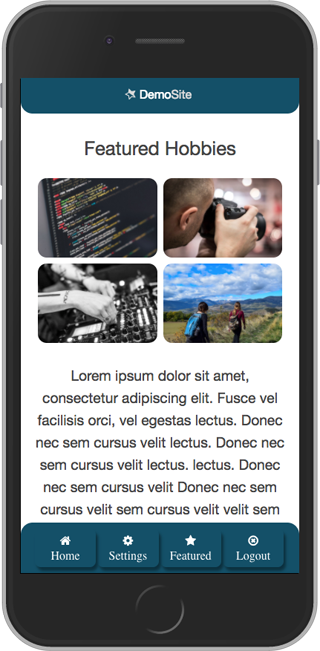

# React App Skeleton
React app skeleton for Node JS with webpack and babel (version with no data store).

A simple boilerplate for starting out a web app using react js.

## Requirements:
Node JS (https://nodejs.org/en/download/)

Yarn package manager (install: https://yarnpkg.com/lang/en/docs/install/)

## Install dependencies:
Run 'yarn install' to install all dependencies inside package.json

Enjoy & use at your own discretion.
